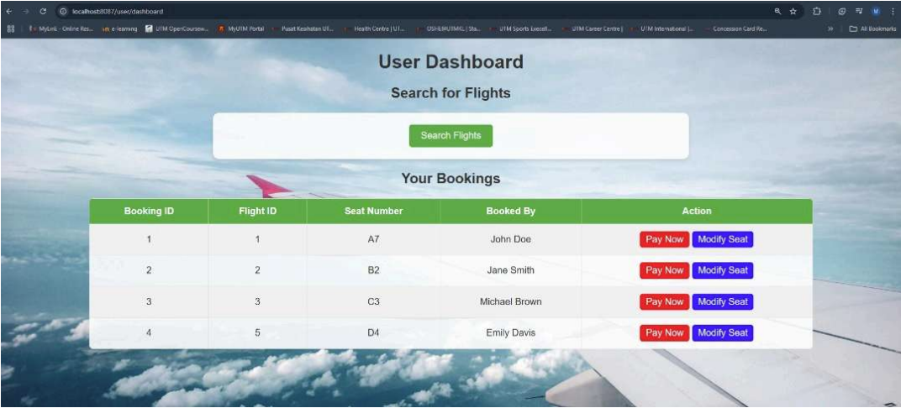

# ✈️ Flight Booking System  
*A full-stack flight management platform with seat selection, booking tracking, and admin controls.*  



---

## ✨ Key Features  
- **User Booking**: Select flights, choose seats, and track reservations.  
- **Admin Dashboard**: Manage flights, seats, and passenger records.  
- **Efficiency Boost**: Reduced manual booking errors by **70%**.  

---

## 🛠️ Technologies  
- **Backend**: Java (Spring MVC), Hibernate  
- **Frontend**: Thymeleaf, HTML/CSS, Bootstrap  
- **Database**: MySQL  
- **Tools**: Maven, Eclipse/IntelliJ  

---

## 🗃️ Database Schema  

### `flight` Table  
```sql
CREATE TABLE --name-- (
  id BIGINT PRIMARY KEY AUTO_INCREMENT,
  arrival_time DATETIME(6),
  available_seats INT NOT NULL,
  departure_time DATETIME(6),
  from_location VARCHAR(255),
  to_location VARCHAR(255)
);
```

### `booking` Table  
```sql
CREATE TABLE --name-- (
  id VARCHAR(255) PRIMARY KEY,
  booked_by VARCHAR(255),
  seat_number VARCHAR(255),
  flight_id BIGINT,
  FOREIGN KEY (flight_id) REFERENCES flight(id) ON DELETE CASCADE
);
```

---

## ⚙️ Setup Guide  

### 1. Prerequisites  
- Java 17+, MySQL 8+, Maven 3.8+  

### 2. Database Setup  
1. Create database:  
   ```sql
   CREATE DATABASE flight_booking;
   USE flight_booking;
   ```
2. Run the table scripts above.  

### 3. Run the Application  
```bash
mvn spring-boot:run
```
Access at: `http://localhost:8080`  


---

## 🚀 Why This Project?  
- **Real-World Use**: Mimics airline booking systems.  
- **Scalable**: Easy to add payment/passenger management.  

---


### 💡 Pro Tips  
- **Extend**: Integrate with Amadeus API for real flight data.  

--- 
